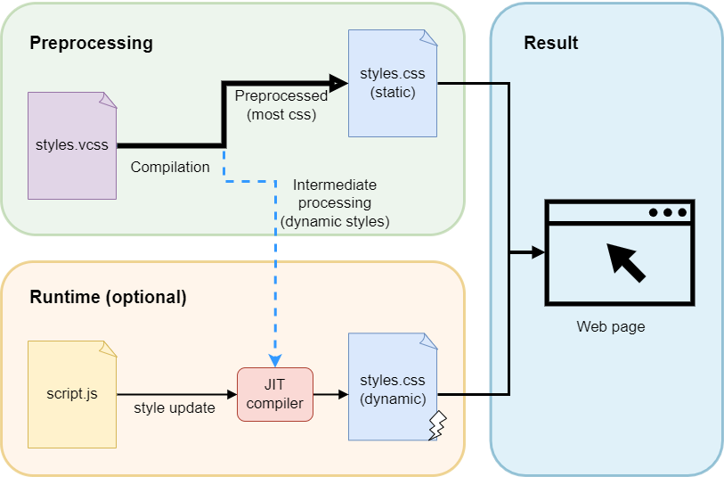

# Void CSS
Void CSS is a powerful, pre and JIT compiled css processor. Void CSS uses sass (scss) inspired syntax to process css into two parts: static (unchanging) and dynamic (updates using JavaScript). This split compilation process preserves the high performance of static css and flexibility of dynamic css.
## Installation

## Features
- JIT compilation
- Scoped css by default (randomized class names)
- High performance
- Plugin/extension support
- Inline media queries
## Examples
### Static example
```scss
.my-class {
    color: blue;
    .nested-class {
        background: red;
    }
    &.conjoined-class {
        font-size: 1.2rem;
    }
}
```
⤷ **compiles to:** ↴
```css
.vcss-my-class-71c3a172f5 {
    color: blue;
}
.vcss-my-class-71c3a172f5 .nested-class {
    background: red;
}
.vcss-my-class-71c3a172f5.conjoined-class {
    font-size: 1.2rem;
}
```
```js
{
    myClass: 'vcss-my-class-4f70cededb'
}
```
## How the compiler works
